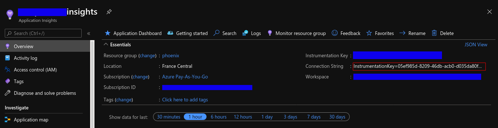

# Azure Digital Twins connector
The aim of this project is to :
 - read data from an ADT
 - flatten these data in a list of CSVData Pojo defined in the library simulator-connector-commons
 - Export Csv Files containing these data

## Changelog

### Version 2.5.0

#### New Features
* Add filters for twins and relationships which enable subgraph querying of an ADT instance:
**N.B:**
- Filter conditional is defined regarding a JSON format: e.g. `{"propertyName": "propertyValue"}`
- Filters are optional (ADT connector will fetch everything in ADT instance when not defined)
- Several filters will generate queries with AND condition: 
  - e.g: 
  - filters: `{"propertyName1": "propertyValue1","propertyName2": "propertyValue2"}`
  - resulting queries: 
    - "`SELECT * FROM digitaltwins T WHERE T.propertyName1 = 'propertyValue1' AND T.propertyName2 = 'propertyValue2'`"
    - "`SELECT * FROM RELATIONSHIPS R WHERE R.propertyName1 = 'propertyValue1' AND R.propertyName2 = 'propertyValue2'`"

#### Documentation:
* Add doc for __TWIN_FILTERS__ environment variable
* Add doc for __RELATION_FILTERS__ environment variable

#### Dependency updates

* Bump kotlin.version from 1.6.10 to 1.7.10
* Bump smallrye-config from 2.9.1 to 3.1.1
* Bump azure-digitaltwins-core from 1.2.0 to 1.3.4
* Bump azure-identity from 1.4.6 to 1.7.2
* Replace javax.annotation-api:1.3.2 by jakarta.annotation-api:2.1.1
* Bump log4j-api from 2.17.2 to 2.19.0
* Bump log4j-core from 2.17.2 to 2.19.0
* Bump jib-maven-plugin from 3.2.0 to 3.3.1
* Bump maven-clean-plugin from 3.1.0 to 3.2.0
* Bump maven-install-plugin from 2.5.2 to 3.1.0
* Bump maven-deploy-plugin from 2.8.2 to 3.0.0


### Version 2.4.0

#### New Features
* Add multithreading for twin fetching

#### Documentation:
* Add doc for CSM_NUMBER_OF_THREAD environment variable

### Version 2.3.3
#### Fix:
* Warning at runtime Failed to load class "org.slf4j.impl.StaticLoggerBinder"

#### Dependency updates:
* Bump actions/checkout from 2.3.4 to 3
* Bump actions/setup-java from 2.3.0 to 3
* Bump azure-digitaltwins-core from 1.1.2 to 1.2.0
* Bump azure-identity from 1.3.6 to 1.4.6
* Bump docker/login-action from 1.10.0 to 1.14.1
* Bump jib-maven-plugin from 3.1.4 to 3.2.0
* Bump junit-bom from 5.8.0 to 5.8.2
* Bump klaxon from 5.5 to 5.6
* Bump kotlin.version from 1.5.31 to 1.6.10
* Bump log4j-core from 2.17.0 to 2.17.2
* Bump log4j-api from 2.17.0 to 2.17.2
* Bump maven-compiler-plugin from 3.8.1 to 3.10.1
* Bump maven-jar-plugin from 3.2.0 to 3.2.2
* Bump smallrye-config from 2.5.0 to 2.9.1

#### Documentation:
* Add doc for AZURE_ADT_TENANT_ID environment variable

### Version 2.3.2

* Bump log4j-api and log4j-core to 2.16.0 in remediation to the Log4Shell ([CVE-2021-44228](https://nvd.nist.gov/vuln/detail/CVE-2021-44228)) (and its variants, like [CVE-2021-45105](https://cve.mitre.org/cgi-bin/cvename.cgi?name=CVE-2021-45105)) vulnerabilities

### Version 2.3.1

* Bump log4j-api and log4j-core from 2.14.1 to 2.16.0 to fix Log4Shell (CVE-2021-44228) vulnerability

### Version 2.3.0

#### New Features

* The connector logs additional information that could be helpful for debugging, like the overall execution time

#### Performance Improvements

* Relationships are now fetched via a bulk retrieval query, allowing for substantial performance improvements on the overall execution time when there are lots of relationships.

#### Dependency updates

* Bump commons-csv from 1.8 to 1.9.0
* Bump smallrye-config from 2.4.2 to 2.4.4
* Bump azure-identity from 1.3.3 to 1.3.5
* Bump jib-maven-plugin from 3.1.2 to 3.1.4
* Bump kotlin.version from 1.5.21 to 1.5.30

### Version 2.2.0

#### New Features

* The container image for this project is continuously scanned for vulnerabilities
* Multi-inheritance in DTDL is now handled

#### Bug fixes

* DTDL `extends` can be a string or a list

### Version 2.1.0

* Write ADT relationship IDs in the corresponding relationship CSV files generated

### Version 2.0.1
* Fix an issue with unexisting target directories
* Added Cosmo Tech Digital Twins Platform manifest for the connector in platform/Connector.yaml
### Version 2.0.0
* Change of target directory property and Env var
export.csv.file.absolute.path -> csm.fetch.absolute.path
EXPORT_CSV_FILE_ABSOLUTE_PATH -> CSM_FETCH_ABSOLUTE_PATH
* use simulator-connector-commons which now default target directory to /mnt/scenariorun-data/
* Add a / at the end of target path if not present
* Remove Application Insights Java Agent
* Watcher for build
* Default registry is localhost:5000
* Github packaging workflow to ghcr.io
* Dependencies updates

## Properties to overwrite :
Here is the list of properties that should be changed (in ```META-INF/microprofile-config.properties``` file):
- **azure.client.id**
- **azure.tenant.id**
- **azure.client.secret**
- **azure.digital.twins.url**
- **csm.fetch.absolute.path**
- **csm.number.of.thread**
- **twin.filters**
- **relation.filters**

If you want to overwrite these properties, you can write your own property values in the ```META-INF/microprofile-config.properties``` file, or set a property's system, or an environment variable named :
- **AZURE_CLIENT_ID** : the Azure client id (can be found under the App registration screen)
- **AZURE_TENANT_ID** : the Azure Tenant id (can be found under the App registration screen)
- **AZURE_CLIENT_SECRET** : the app client secret (a already created secret can not be retrieved, thus it must be asked from its creator or a new one should be created)
- **AZURE_ADT_TENANT_ID** : the ADT tenant id
- **AZURE_DIGITAL_TWINS_URL** : the url of the ADT targeted (can be found in the specific resource screen)
- **CSM_FETCH_ABSOLUTE_PATH** : the absolute path to export all csv files (don't forget the / at the end)
- **CSM_NUMBER_OF_THREAD** : The amount of thread used to retrieve twin information from ADT (default 1)
- **TWIN_FILTERS** : Filters you want to apply to twins in your ADT instance to query a sub graph (default blank) (example: {"propertyName","propertyValue"})
- **RELATION_FILTERS** : Filters you want to apply to relationships in your ADT instance to query a sub graph (default blank) (example: {"propertyName","propertyValue"})

## Log level
Default log level defined is "info".
We use the logging API [log4j2](https://logging.apache.org/log4j/2.x/manual/index.html).
You can change the log threshold by setting an environment variable named: **LOG_THRESHOLD_LEVEL**.
Log levels used for identifying the severity of an event. Log levels are organized from most specific to least:
- OFF (most specific, no logging)
- FATAL (most specific, little data)
- ERROR
- WARN
- INFO
- DEBUG
- TRACE (least specific, a lot of data)
- ALL (least specific, all data)


## Application insights
*FEATURE IS DISABLED IN V2*
The connector comes with a javaagent for adding connector's outputs to an application insights.

Create an application insight through portal.azure and set the connection string into the file ```/src/main/jib/applicationinsights.json```



##Change the default container registry

Modify the pom.xml or set options directly in jib:build command
```
See [Jib project Configuration]("https://github.com/GoogleContainerTools/jib/tree/master/jib-maven-plugin#configuration") to set correctly your container registry (GCR, ECR, ACR, Docker Hub Registry)

Build your container image with:

```shell
mvn compile jib:build -Djib.allowInsecureRegistries=true
```

Subsequent builds are much faster than the initial build.

##Build to GitHub Registry
This project defines a GitHub workflow which build to ghcr.io. Example:
``` shell
mvn compile jib:build \
  -Djib.to.image="ghcr.io/cosmo-tech/azure-digital-twins-simulator-connector:latest" \
  -Djib.to.auth.username="${{ github.actor }}" \
  -Djib.to.auth.password="${GITHUB_TOKEN}"
```

#### Build to Docker daemon

Jib can also build your image directly to a Docker daemon. This uses the `docker` command line tool and requires that you have `docker` available on your `PATH`.

```shell
mvn compile jib:dockerBuild
```

For more information, see [Jib project Build]("https://github.com/GoogleContainerTools/jib/tree/master/jib-maven-plugin#build-your-image")

### Watch build
To watch for file modifications and do continuous build run
```shell
mvn fizzed-watcher:run
```

#### How to run your image locally 

```
docker run \ 
-v <<local_export_dir_path>>:/tmp \
-e CSM_FETCH_ABSOLUTE_PATH=/tmp/ \
-e AZURE_DIGITAL_TWINS_URL=https://XXX.XXX.XXX.digitaltwins.azure.net \
-e AZURE_TENANT_ID=<<azure_tenant_id>> \
-e AZURE_CLIENT_ID=<<azure_client_id>> \
-e AZURE_CLIENT_SECRET=<<azure_client_secret>> \
<your_container_registry>/azure-digital-twins-simulator-connector
```

You can find all export files under the directory "local_export_dir_path" specified above


## How-to

```
    <dependency>
      <groupId>com.github.Cosmo-Tech</groupId>
      <artifactId>azure-digital-twins-simulator-connector</artifactId>
      <version>1.0-SNAPSHOT</version>
    </dependency>
```

## Tasks : 

- [ ] Create a Dockerfile instead of using JIB (and manage applicationinsights-agent download in it)
- [ ] Add more logs (maybe with some metrics: e.g. amount of twins/relationships)
- [x] Handle properties on relationship
- [x] Handle multiple extends for properties
- [x] Handle multiple extends
